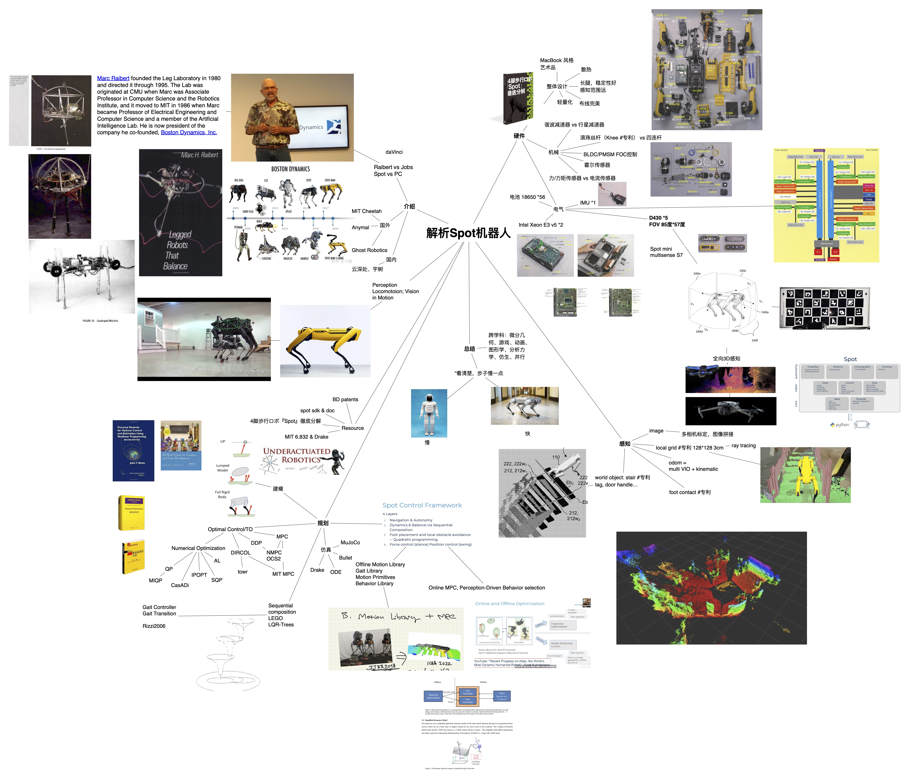

  

## Spot locomotion control system[^1]

## 解析 Spot 机器人 (Introduction to Spot)

[recorded video Links](https://www.bilibili.com/video/BV1ZP4y1J7xk)

[slides with transcript](https://github.com/matheecs/introduction-to-spot/blob/master/introduction-to-spot-slides.pdf)

This repository contains some useful books, papers and patents about Spot.

Contact me via WeChat: matheecs

[^1]: https://bostondynamics.com/blog/starting-on-the-right-foot-with-reinforcement-learning
